# 0. このドキュメントについて
このドキュメントはClovaスキルを`Node.js`で実装するための非公式なハンズオンチュートリアルです。
このドキュメントの通りに実装すれば、簡単なClovaスキルを動かすこと、スキルへの対話を元にLINEメッセージを送信することができ、スキルの発話結果をLIFFを使ってLINE上に表示することができます。
はじめてのClovaスキルの実装や、ClovaスキルとLINE Botの連携にご活用ください。

今日説明できないLINEの主なAPI
* [Flex Message](https://developers.line.me/ja/docs/messaging-api/using-flex-messages/)
* [Rich Menu](https://developers.line.me/ja/docs/messaging-api/using-rich-menus/)
* [LINE Beacon](http://ozyozyo.hatenablog.com/entry/2016/10/16/152409)
* [LINE Pay API](https://qiita.com/nkjm/items/b4f70b4daaf343a2bedc)

## 0.1. 必要なもの
- LINE ID(スマホでLINEを登録し、メールアドレスの登録まで完了させてください)
- Clovaデバイス
- インターネットに接続され、CLIで操作できるコンピュータ

## 0.2 利用するもの(詳細は後述します)
- Clova-CEK-SDK-Nodejs
- ngrok

# 1. はじめに
## 1.1 Clovaスキルとは
Clovaにはデバイス購入時にそのまま利用することができるビルトインのスキルと、スキルストアに掲載されているスキルの2種類があります。
スキルストアは、Clovaアプリを起動し、ホーム画面にある導線をタップすると開くことができます。
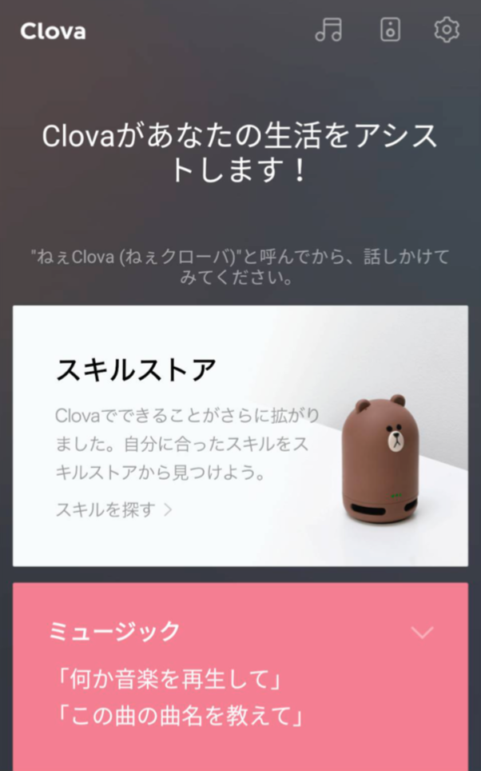

Clovaスキルは、スキルストア詳細画面にて確認できる`呼び出し名`を利用して起動することができます。
- `呼び出し名`を起動して
- `呼び出し名`を開いて
- `呼び出し名`をつないで

スキルの起動をせずにスキルを利用開始することはできません。
また、一度起動したスキルはスキルサーバーから明示的に終了するリクエストを送った場合[shouldEndSession](https://clova-developers.line.me/guide/#/CEK/References/CEK_API.md#CustomExtSessionEndedRequest)か、ユーザが`終了して`などスキルを終了する発話をするまでは、起動したスキルが応答をする状態になります。
`ねぇClova、XXを起動して`という発話から、スキルが終了するまでを1セッションと扱います。

そのため、特定のスキルを起動中に`今日の天気は？`とユーザが発言したとしても、通常のClovaのお天気機能が呼び出されることはありませんし、1度スキルが終了してしまったら再度スキルの起動を促す発話をユーザがするまで、スキルは起動状態にすることができません。

```
★ やってみよう

ねぇClova、激むず早口言葉を起動して！と話しかけて実際のスキルの挙動を確認してみよう
```

## 1.2 Clovaが提供してくれること、スキルが実装すること
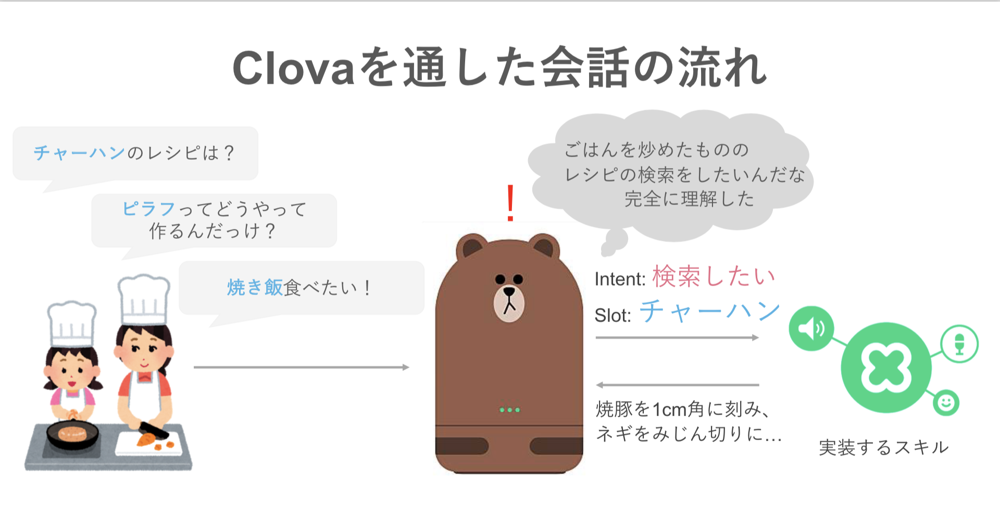

Clovaはユーザの発話を、インテント/スロットという形式に変換してスキルサーバーにリクエストします。
スキルサーバーから、これらのリクエストを適切にハンドリングするAPIを提供します。


## 1.3 スキルの公開までのフロー
スキルを公開するには以下の手順を踏む必要があります。
* [チャネルを作成する](https://clova-developers.line.me/guide/#/DevConsole/Guides/CEK/Create_Channel.md)
* [Extensionを登録する](https://clova-developers.line.me/guide/#/DevConsole/Guides/CEK/Register_Extension.md)
* [対話モデルを登録する](https://clova-developers.line.me/guide/#/DevConsole/Guides/CEK/Register_Interaction_Model.md)
* [対話モデルをテストする](https://clova-developers.line.me/guide/#/DevConsole/Guides/CEK/Test_Extension.md)
* [Clovaデバイスでテストする](https://clova-developers.line.me/guide/#/DevConsole/Guides/CEK/Device_Test_Extension.md)
* [Extensionを配布する](https://clova-developers.line.me/guide/#/DevConsole/Guides/CEK/Deploy_Extension.md)

[Extensionを配布する](https://clova-developers.line.me/guide/#/DevConsole/Guides/CEK/Deploy_Extension.md)の中で、[審査をリクエストする](https://clova-developers.line.me/guide/#/DevConsole/Guides/CEK/Deploy_Extension.md#RequestExtensionSubmission)という項目で説明されている通り、スキルを公開する前には審査が必要になります。

# 2. 下準備
## 2.1 LINE DevelopersとClova Developer Centerβ
Clovaのスキルを作成するには2つのDeveloper Centerを操作する必要があります。
* [LINE Developers](https://developers.line.me/ja/)
* [Clova Developer Centerβ](https://clova-developers.line.me/)

## 2.2 チャネルを作成する
### 2.2.1 プロバイダーを作成する
プロバイダーとは？
> チャネルにアプリを提供する個人または組織。チャネルを作成するには、LINE Developersコンソールでプロバイダーを作成する必要があります。例えば、個人や企業の名前をプロバイダーとして使用できます。

引用元: [用語集](https://developers.line.me/ja/docs/glossary/)

Botやスキルを実装するには、プロバイダーとチャネルの両方を作る必要があります。

※ スキルとLINEを連携して利用するには同一のプロバイダーにBotのチャネルとスキルのチャネルを作る必要があります

プロバイダを作成するには、[LINE Developersのプロバイダーリスト](https://developers.line.me/console/)にアクセスして、プロバイダを新規作成します。右上の青いボタンを押してください。
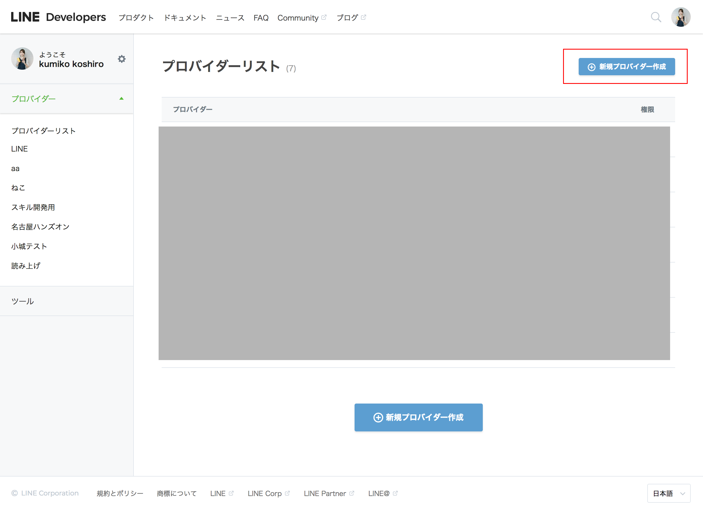

次に、プロバイダ名を入力して、確認するボタンを押します。
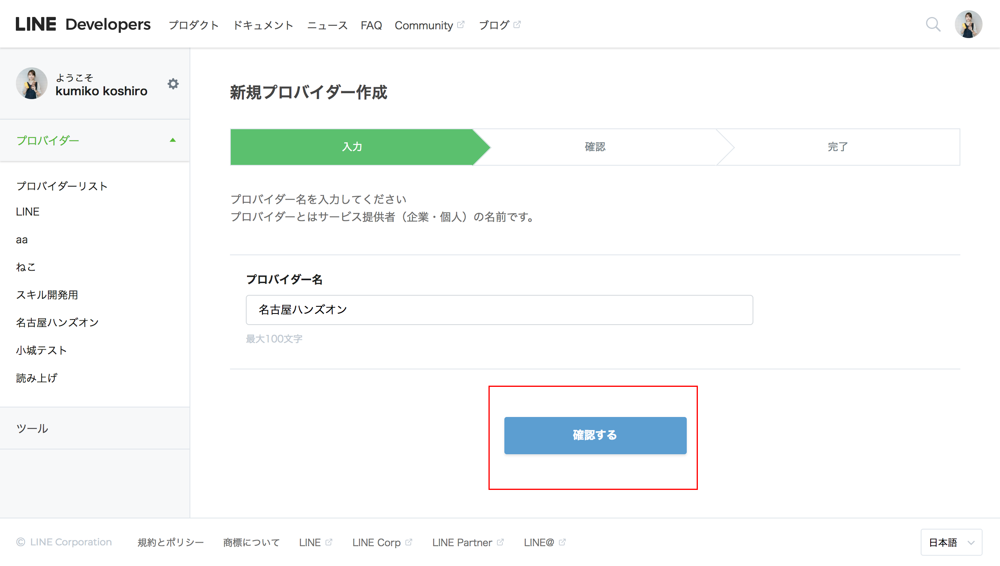

確認画面を進みます。


### 2.2.2 Botチャネルを作成する
プロバイダを作成後、以下のような画面に遷移するので、真ん中のMessaging APIのチャネルを作成するボタンを押します。
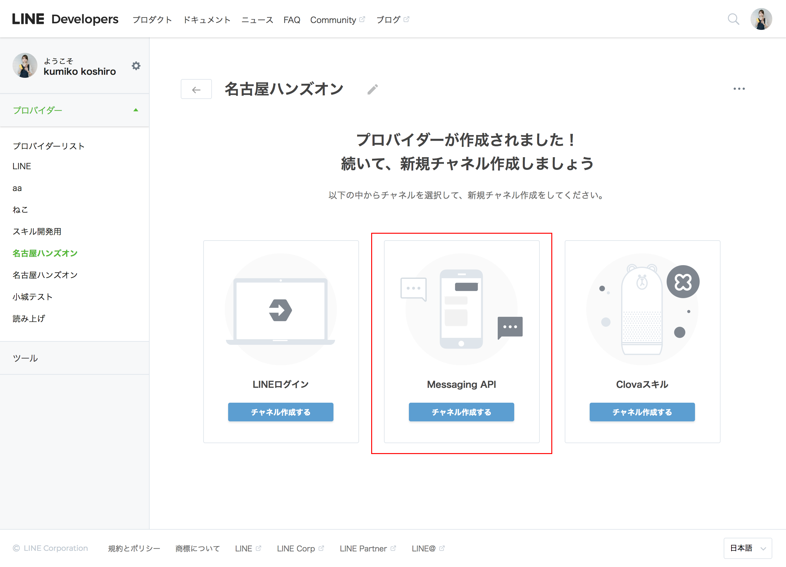

必要な項目を埋めていきます。
アプリ名はBotの名称になる部分です。今日はハンズオンなので適宜埋めてください。

※ テスト用にはDeveloperTrialで作成してください。


同意します。
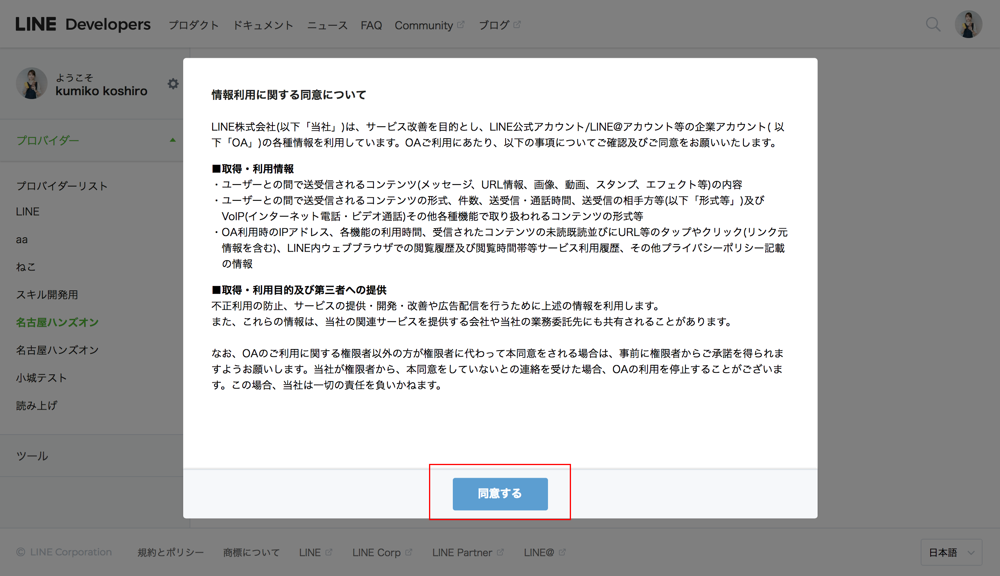

確認して、チェックボックスをチェックします。
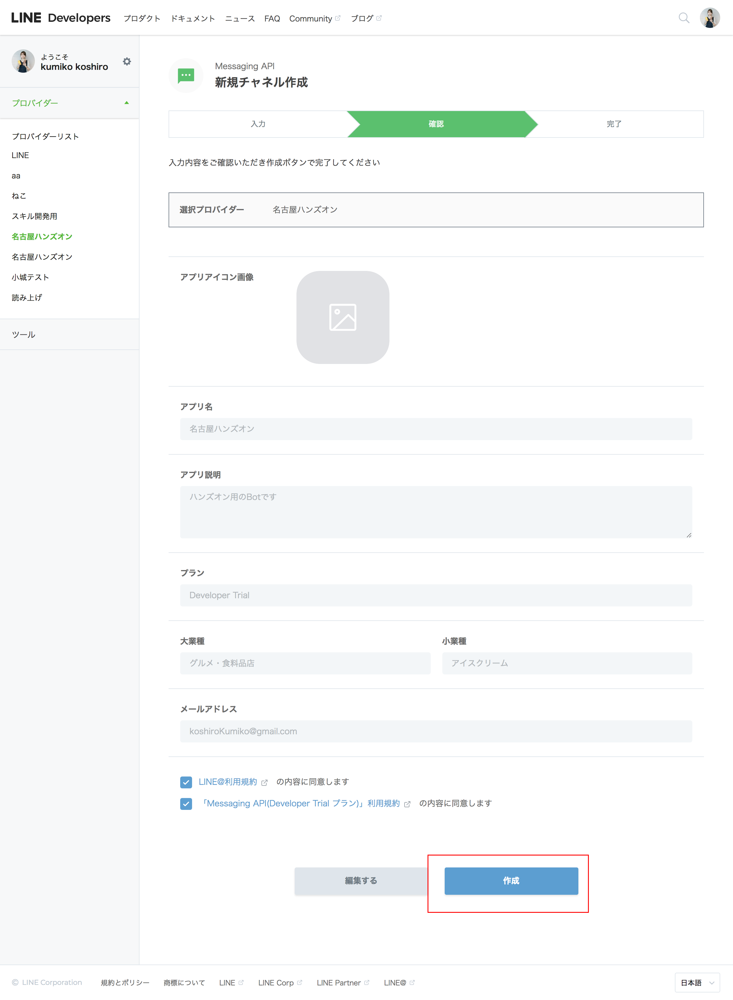

これで、Botの作成が終わりました。作成したBotの設定画面からQRコードを読み取って、友だちになっておきましょう。
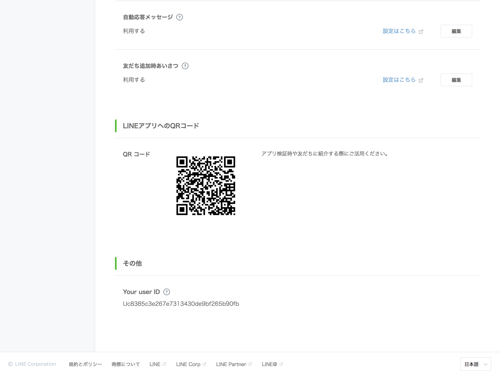

## 2.2.3 スキルチャネルを作成する
つぎに[Clova Developer Centerβ](https://clova-developers.line.me/)にアクセスします。
スキル設定タブの最下部にある緑のボタン`LINE Developersでスキルチャネルを新規作成`をクリックします。

LINE Developersに遷移するので、`Botチャネルを作成する`で作成したプロバイダーを選択します。※連携するBotとスキルのチャネルは同じプロバイダーに作成しなければいけません。
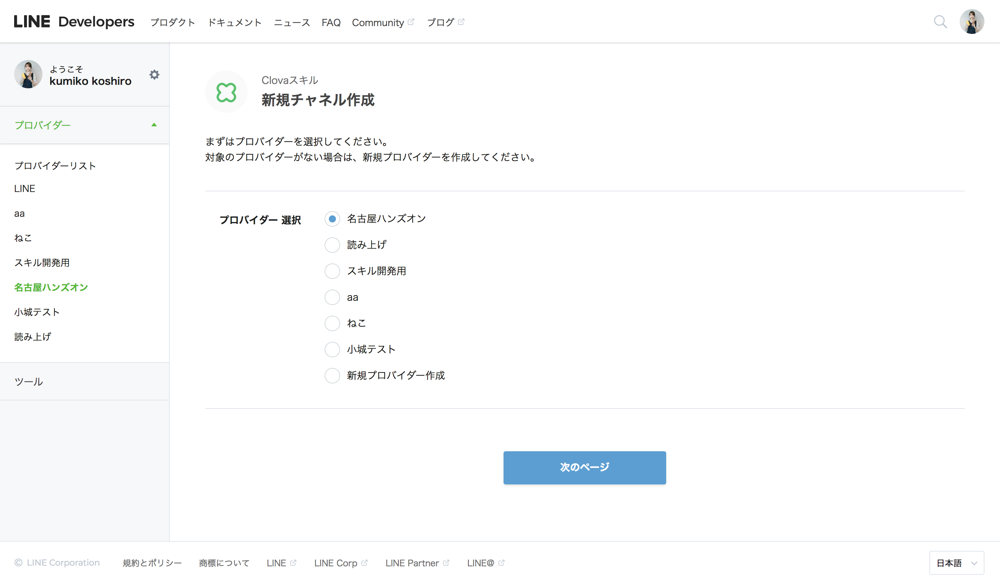

以下のようにスキルの情報を入力します。チャネル名はユーザに露出しない値なので、ご自身が識別できる名称で記載してください。
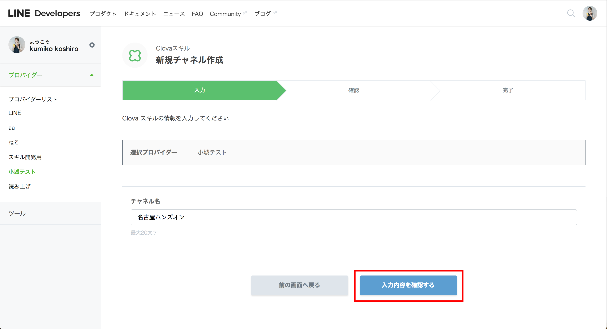

確認画面に進みます。`作成してLINE Developersに移動`をクリックします。
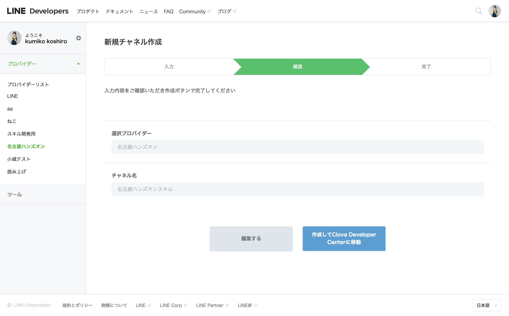

スキルの基本情報を以下のように入力します。

!!! ExtensionIdは後から変更することはできません。人と被らない値を入力する必要があります。 !!!

Extensionと連携するLINEのアカウントは先程作成したBotのアカウントを選択しておいてください。
各項目の詳細な説明は[公式ドキュメント](https://clova-developers.line.me/guide/#/DevConsole/Guides/CEK/Register_Extension.md)を確認してください。

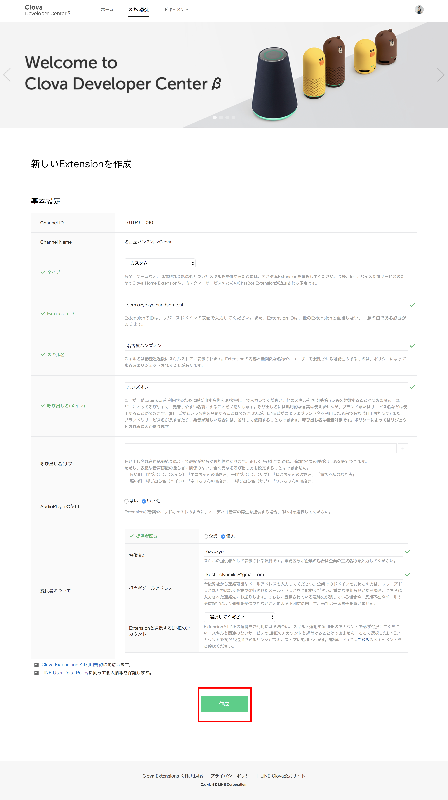

確認画面に遷移するので次へをクリックしてください。
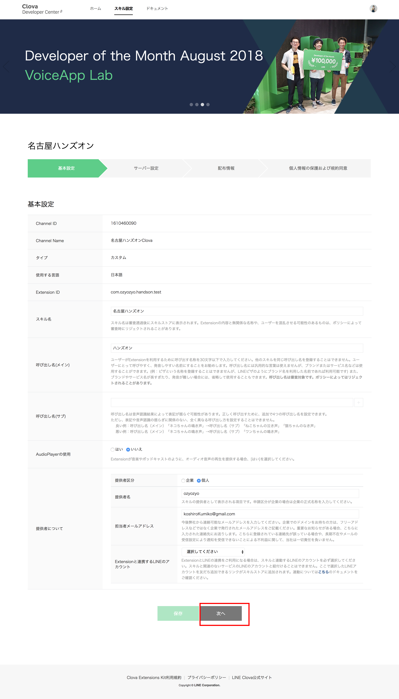

サーバの設定画面に遷移しますが、まだサーバーを作っていないのでスキップしていきます。
バーの一番右の`個人情報の保護および規約同意`をクリックしてください。
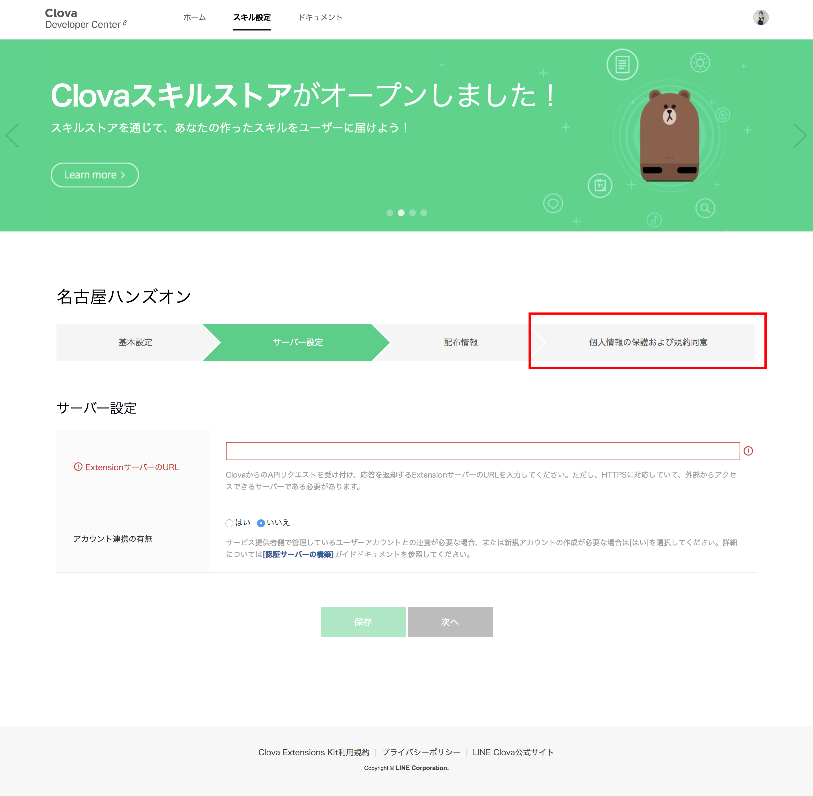
この画面の登録もスキップします。何も入力せずに、最下部の`対話モデル`ボタンをクリックして、対話モデルの設定画面を開きます。
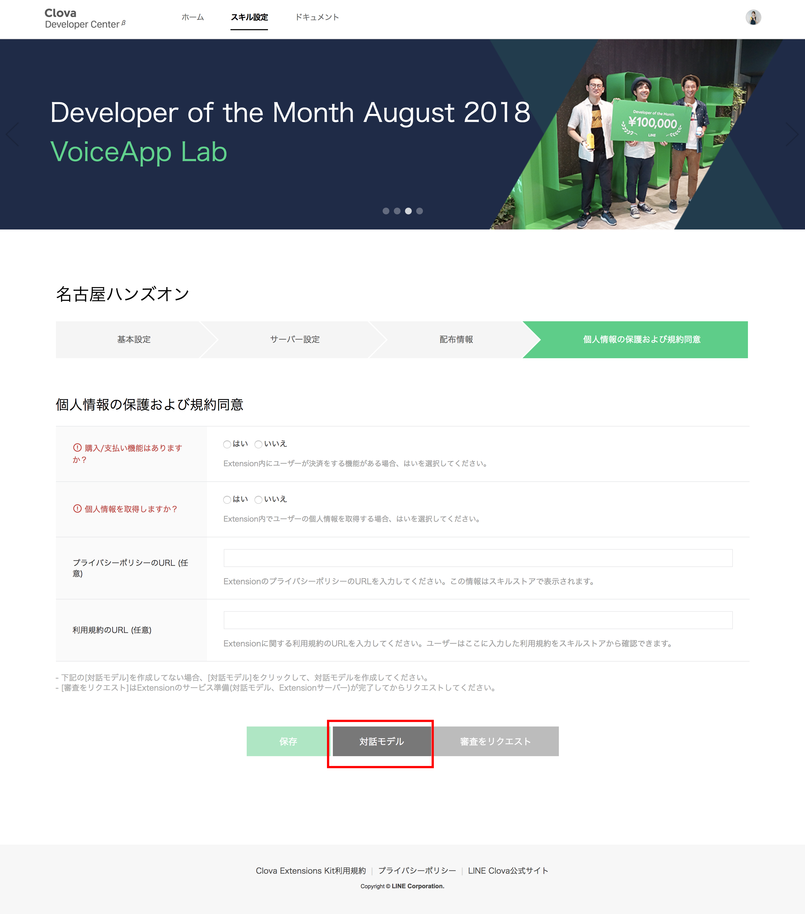

★ 困ったら見るべき公式ドキュメント
[チャネルを作成する](https://clova-developers.line.me/guide/#/DevConsole/Guides/CEK/Create_Channel.md)

# 3. スキルを作り始める
## 3.1 ゴールとシナリオを決定する
これから実装するスキルが提供するシナリオのゴールを決定しましょう。

★公式ドキュメント: [目標を設定する](https://clova-developers.line.me/guide/#/Design/Design_Guideline_For_Extension.md#SettingGoal)

### 3.1.1 今日実装するシナリオ
ハンズオンなので今日は以下のシナリオを1つずつ実装していきましょう。
* ユーザー「ねぇClova、ハンズオンスキルを起動して」
  * Clova (こんにちは、ご出身は何県ですか？)
* ユーザー「愛知県」 ※ Intent: AnswerPrefecture
  * Clova (愛知県なんですね。好きな食べ物はなんですか？)
  * Botからユーザーに「愛知県なんですね」というLINEを送信する
* ユーザー「手羽先です」 ※ Intent: AnswerFavoriteFood
  * Clova (愛知県出身で手羽先がお好きなんですね)

## 3.2 対話モデルを構築する
対話モデルを構築して、これから実装するスキルサーバーへのRequestを確定させましょう

★ 困ったら見るべき公式ドキュメント
* 対話モデルとは？->[対話モデルを定義する](https://clova-developers.line.me/guide/#/Design/Design_Guideline_For_Extension.md#DefineInteractionModel)
* 実際の操作->[対話モデルを登録する](https://clova-developers.line.me/guide/#/DevConsole/Guides/CEK/Register_Interaction_Model.md)

### 3.2.1 構築を開始する
まず、シナリオのうち、ユーザーが出身地を答える部分を作ります。
具体的には以下のビルトインスロットとカスタムスロットを作成していきます。
* ビルトインスロット: CLOVA.JP_ADDRESS_KEN
* カスタムインテント: AnswerPrefecture

先程開いた対話モデル画面を表示し、左側のメニューの下部にあるビルトインスロットタイプの右側の＋ボタンを押してください。


続いて、今回利用する`CLOVA.JP_ADDRESS_KEN`にチェックを入れて右上の保存ボタンをクリックします。
`CLOVA.JP_ADDRESS_KEN`は日本の都道府県の一覧辞書であり、Clovaが予め用意しているスロット辞書になります。
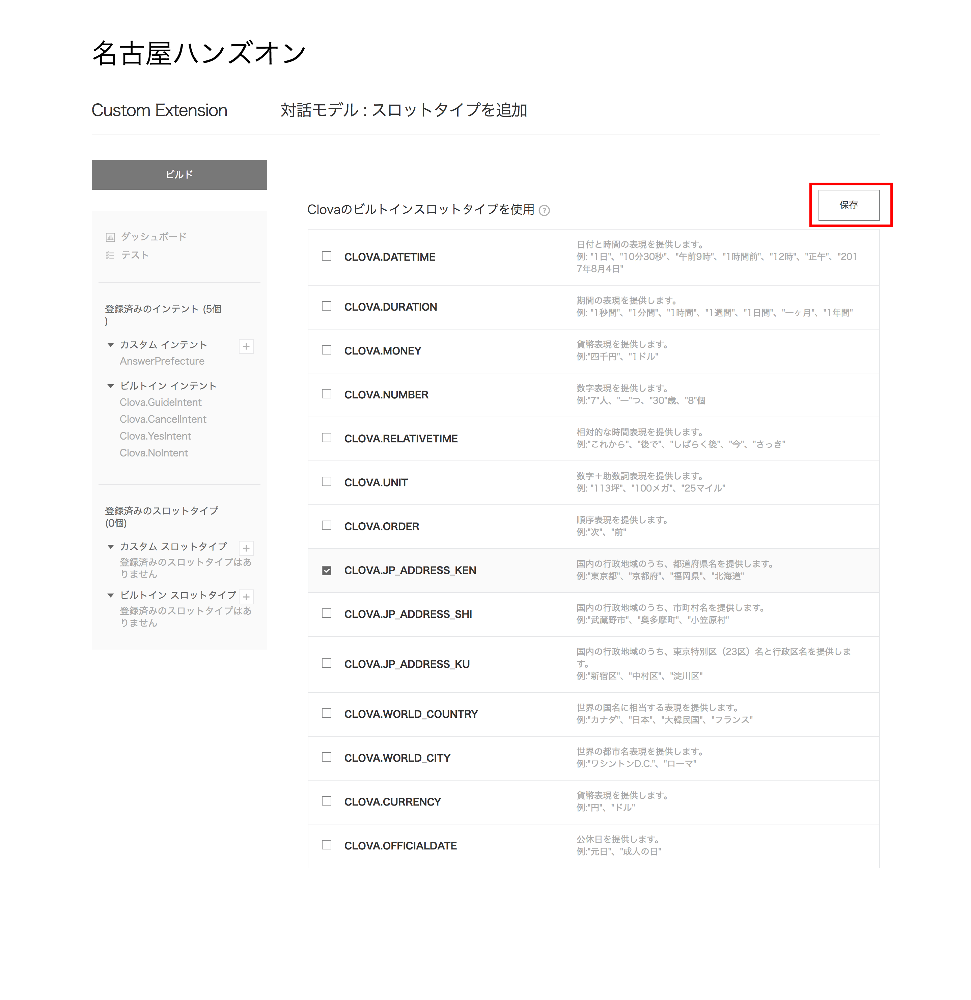

次にインテントを作成します。左メニューのカスタムインテントの＋ボタンをクリックして、新規のカスタムインテントを作成しましょう。インテントの名前は、`AnswerPrefecture`にしてください。
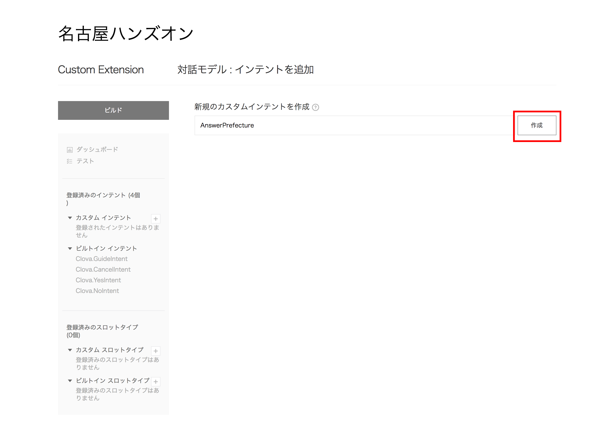

このtsvファイルをアップロードします。
今回はすでに構築できているものを利用しますので、以下の.tsvをローカルに用意してください。

* [AnswerPrefectureの設定tsvファイル](./document/tsv/com.ozyozyo.handson.test_intent_AnswerPrefecture.tsv)

こちらからアップロード。
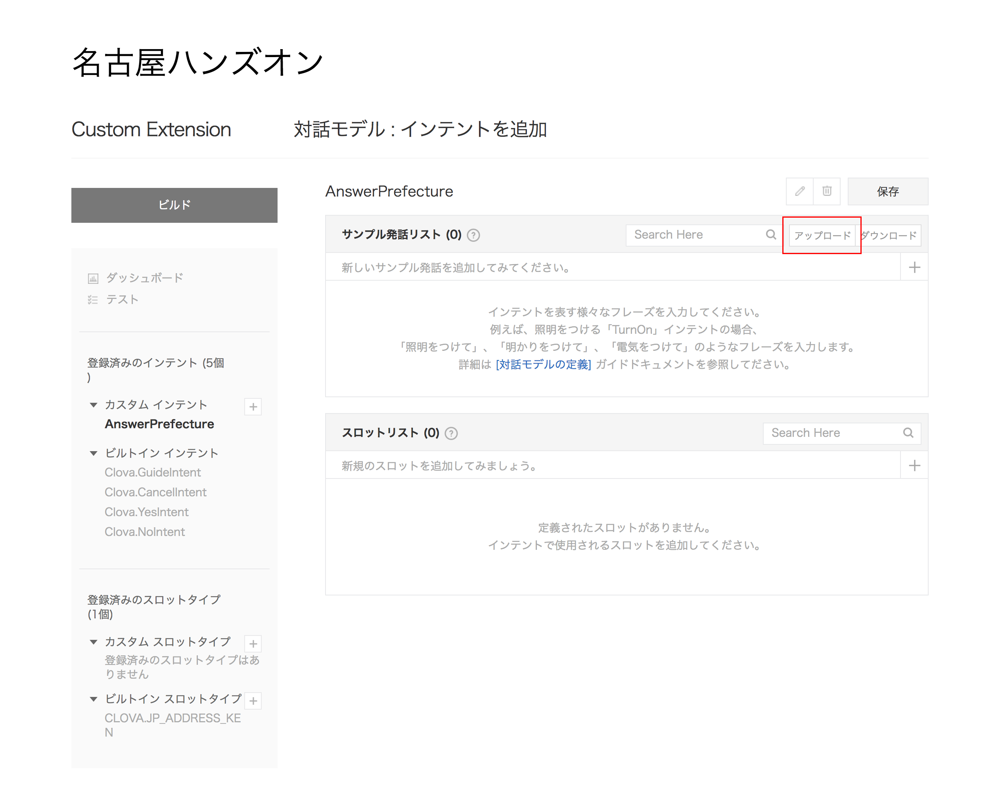

ファイル選択でtsvを選択。
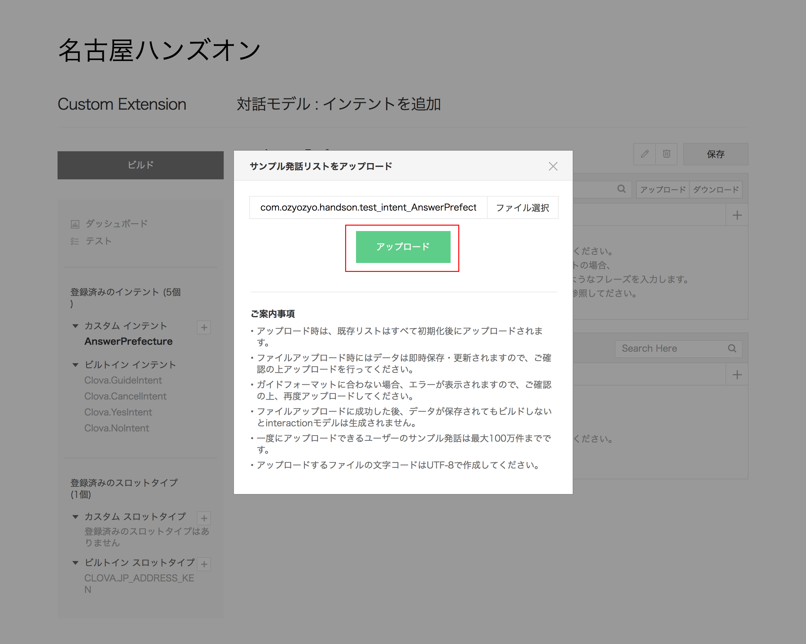

アップロードボタンをクリック。
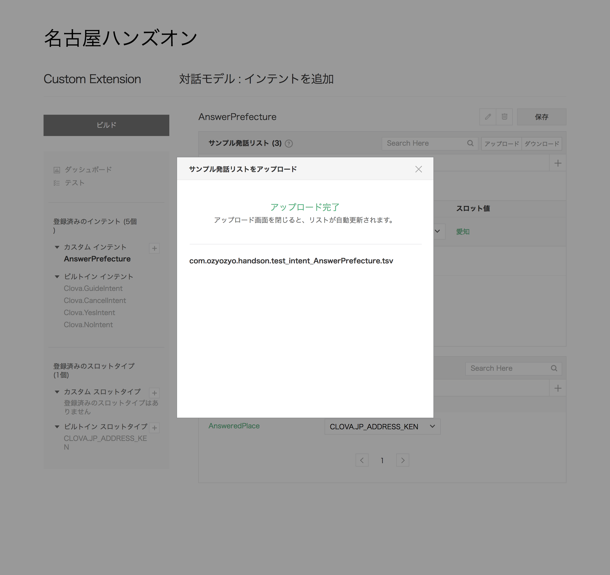

アップロードができたら、中身を確認していきましょう。
ここにはいくつかの`サンプル発話`が登録されています。
ユーザが発話しそうな言い回しをここに複数登録しておきましょう。
そして、`Slot`として抽出したい引数に当たる部分には先程登録した`CLOVA.JP_ADDRESS_KEN`がアサインされていることがわかります。

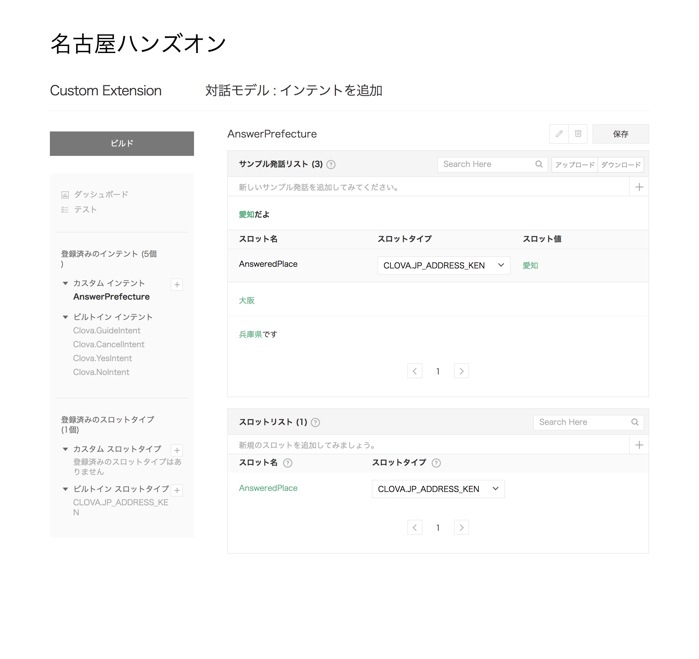
```
★ やってみよう
「私の出身は愛知県です」をサンプル発話に追加してみよう
```
-> [回答はこちら](document/Tutorial_add_sample_conversation.md)

登録ができたらビルドをします。対話モデルはビルドをしないと修正が反映されないので忘れないようにしましょう。
ビルドには3分程度かかりますのでしばらくお待ち下さい。
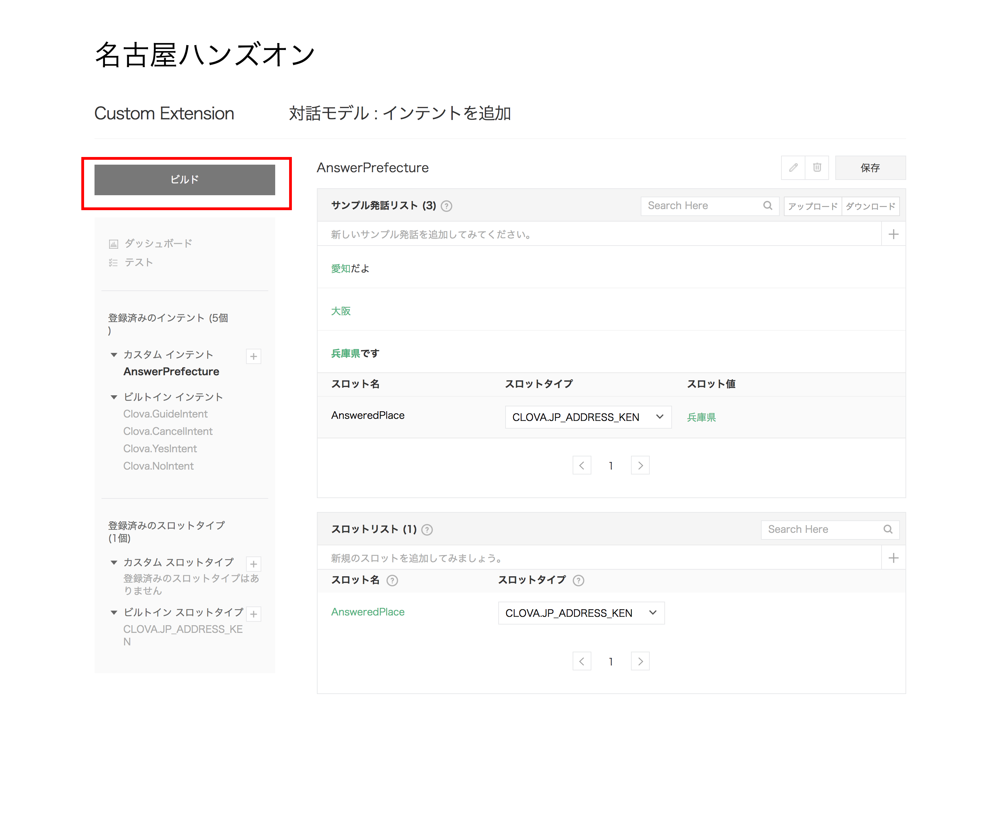

## 3.3 スキルサーバーを実装する
それでは、ついにいよいよ、スキルサーバーの実装に入ります。

node.js/npmはインストールできていますか？
まだの方は先に実行しておきましょう。
* windows: https://qiita.com/taiponrock/items/9001ae194571feb63a5e
* Mac: https://codenote.net/mac/homebrew/346.html

完了している方は以下を実行していきます。
```
$ npm init -y
$ npm i @line/clova-cek-sdk-nodejs express body-parser
```

`skill.js`というファイルを作成し、以下のコードを貼り付けてください。
```
// 必要な設定を読み込む
const clova = require('@line/clova-cek-sdk-nodejs');
const express = require('express');

// TODO: あなたのEXTENSION_IDに置き換えてください
const EXTENSION_ID = 'your extension id';

// `IntentRequest`が呼び出されたときに実行されます
const intentHandler = async responseHelper => {
  const intentName = responseHelper.getIntentName();
  const sessionId = responseHelper.getSessionId();

  // Intentの名前をログに出力します
  console.log('intentName: ' + intentName);

  switch (intentName) {
    case 'Clova.YesIntent':
      // ユーザーが`はい`と発話したときは`はいはい`と返事します
      responseHelper.setSimpleSpeech(
        clova.SpeechBuilder.createSpeechText('はいはい')
      );
      break;
    case 'Clova.NoIntent':
      // ユーザーが`いいえ`と発話したときは`いえいえ`と返事します
      responseHelper.setSimpleSpeech(
        clova.SpeechBuilder.createSpeechText('いえいえ')
      );
      break;
    default:
      // ユーザーがそれ以外の発話をしたときは`なんなん`と返事します
      responseHelper.setSimpleSpeech(
        clova.SpeechBuilder.createSpeechText('なんなん')
      );
      break;
  }
};

const clovaHandler = clova.Client
  .configureSkill()
  .onLaunchRequest(responseHelper => {
    // スキル起動直後には`こんにちは、ご出身は何県ですか？`と発話します
    responseHelper.setSimpleSpeech(
      clova.SpeechBuilder.createSpeechText('こんにちは、ご出身は何県ですか？')
    );
  })
  // ユーザが発話をしたときには`intentHandler`を呼び出します
  .onIntentRequest(intentHandler)
  // スキル終了時には何もしません
  .onSessionEndedRequest(responseHelper => {})
  .handle();

const app = new express();
const clovaMiddleware = clova.Middleware({ applicationId: EXTENSION_ID });

app.post('/clova', clovaMiddleware, clovaHandler);

const port = process.env.PORT || 3000;
app.listen(port, () => {
  console.log(`Server running on ${port}`);
});
```

貼り付けることができたら、EXTENSION_IDを自分で設定したものに置き換えてください。
以下のコマンドで貼り付けたコードを実行してみましょう
```
$ node skill.js
```

今日は手元のパソコンで簡易的にスキルを実装するので、`ngrok`というツールを利用します。
以下のコマンドで`ngrok`を入手してください。
```
$ npm i -g ngrok
```

入手ができたら、新しいターミナルを立ち上げて以下のコマンドで実行しましょう。
```
ngrok http 3000
```

問題なく実行が終わったら、いくつかのURLが表示されるはずです。
その中のForwardingというhttpsから始まるURLを使います。
今回は`/clova`に実行するプログラムを配置するので、`https://${Fording URL}/clova`をコピーして、[Clova Developer Centerβ](https://clova-developers.line.me)で設定しましょう

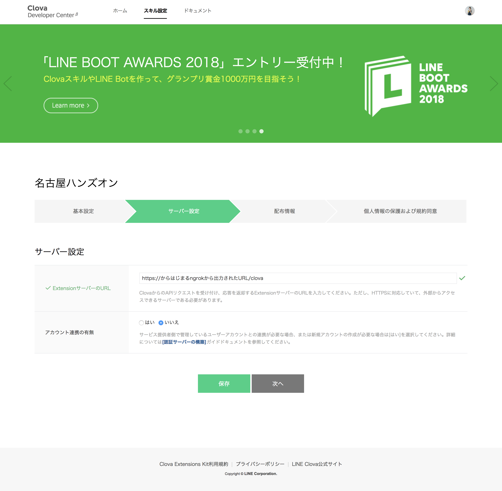

## 3.4 テストしてみよう
### 3.4.1 テストツールから実行
「はい」と入力してみましょう。
「はいはい」という応答が返ってきましたか？
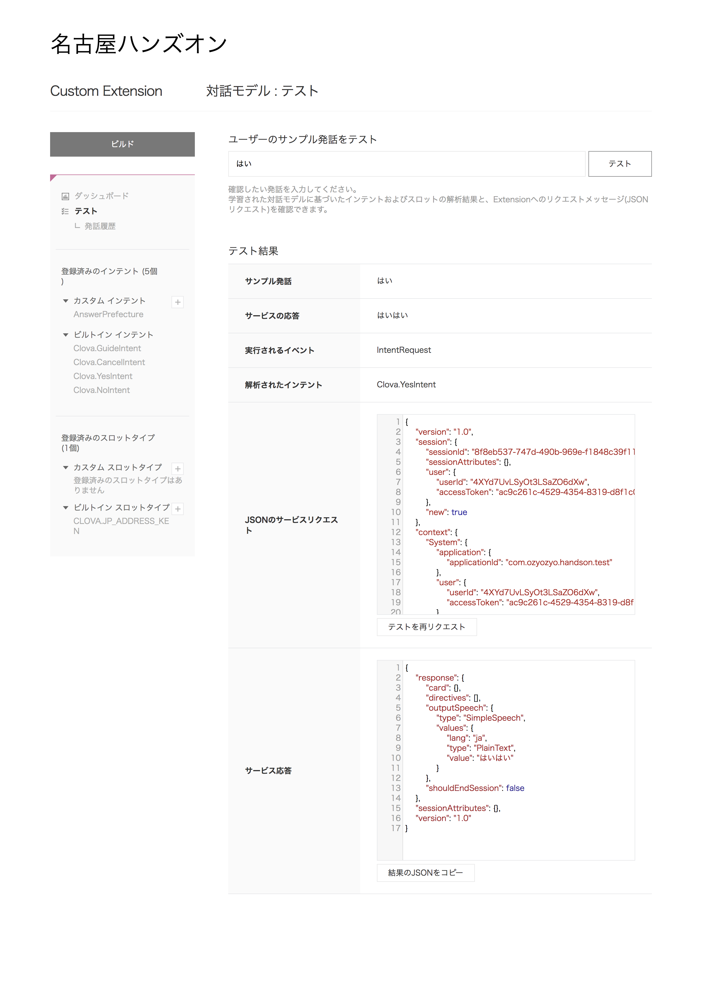

### 3.4.2 実機から実行
Clovaデバイスに「呼び出し名(メイン)を起動して」と発話してみましょう
* [ハンズオン用Clovaとの接続方法](https://www.dropbox.com/s/pln05xb6kf007dm/Clova%E3%81%A8%E3%81%AE%E6%8E%A5%E7%B6%9A%E6%96%B9%E6%B3%95.pdf?dl=0)

#### 起動できない場合
音声認識結果を確認しましょう。テストの下にある発話履歴を確認します。
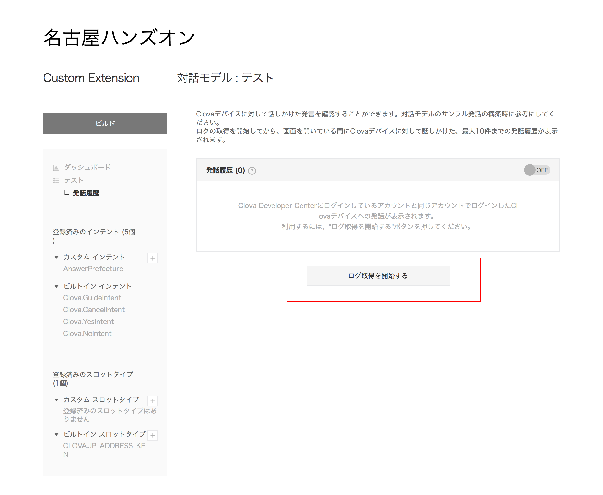

ログの取得を開始するボタンを押して、もう一度「呼び出し名(メイン)を起動して　」と発話してみましょう。
この例だと、呼び出し名(メイン)は`ハンズオン`ですが、`半ズボン`に揺らいでしまっていることがわかります。
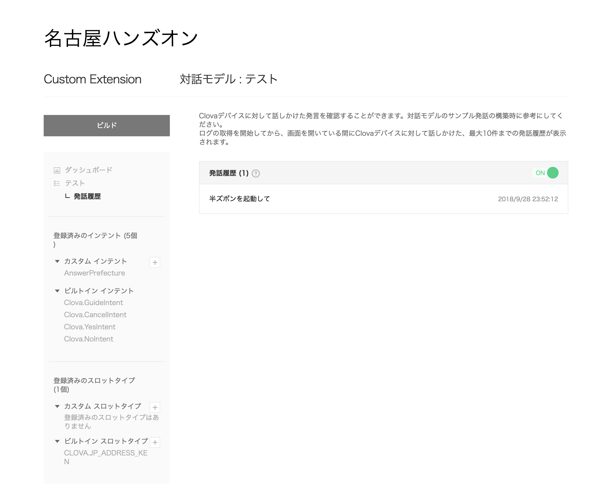

スキル設定から、呼び出し名(サブ)に`半ズボン`を追加しておきましょう。
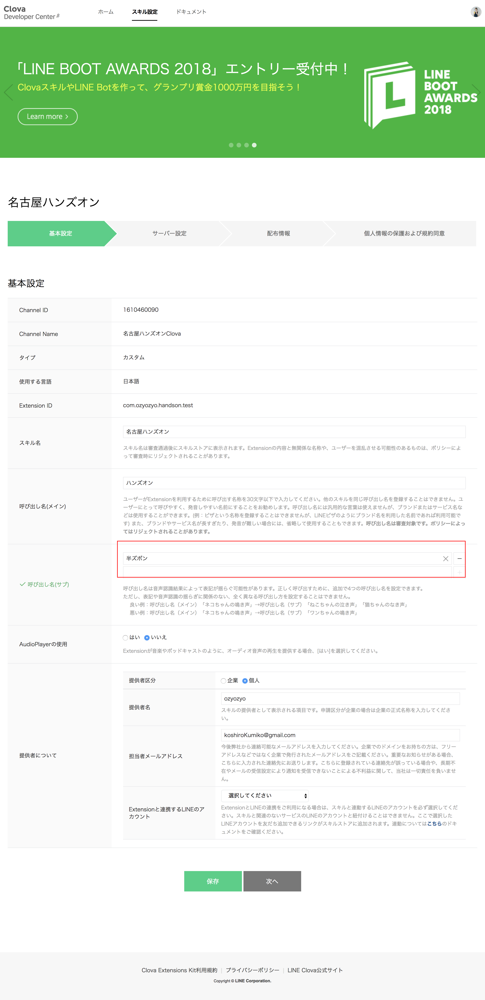

※ 忘れずに保存ボタンを押してください。

## 3.5 Slotを取得してみよう
では、次に「愛知県です」をテストしてみましょう。「なんなん」と返ってくるはずです。
これから、「愛知県です」とユーザが発話したら、Clovaから「愛知県なんですね。」とお返事するように変更していきましょう。

先程貼り付けたプログラムには以下のようにintentNameをログに出力するように書かれていました。
```
  console.log('intentName: ' + intentName);
```
"愛知県です"と発話した後のログを確認してみましょう。intentNameを確認することができましたか？
確認できたら一度、`skill.js`を実行しているターミナルでコントロールキー+Cを押してサーバーの実行を停止してください。

次に`intentHandler`を以下のコードに置き換えてみてください。

([src/sample/tutorial2.js](https://github.com/ozyozyo/clova-cek-tutorial-nodejs/blob/master/src/sample/tutorial2.js)を参照)

```
// `IntentRequest`が呼び出されたときに実行されます
const intentHandler = async responseHelper => {
  const intentName = responseHelper.getIntentName();
  const sessionId = responseHelper.getSessionId();

  // Intentの名前をログに出力します
  console.log('intentName: ' + intentName);
  // Slotの一覧をログに出力します
  const slots = responseHelper.getSlots();
  console.log(slots);

  switch (intentName) {
    case 'AnswerPrefecture':
      // ユーザーが県名を回答したときは復唱する
      responseHelper.setSimpleSpeech(
        clova.SpeechBuilder.createSpeechText(`${slots.AnsweredPlace}なんですね`)
      );
      break;
    case 'Clova.YesIntent':
      // ユーザーが`はい`と発話したときは`はいはい`と返事します
      responseHelper.setSimpleSpeech(
        clova.SpeechBuilder.createSpeechText('はいはい')
      );
      break;
    case 'Clova.NoIntent':
      // ユーザーが`いいえ`と発話したときは`いえいえ`と返事します
      responseHelper.setSimpleSpeech(
        clova.SpeechBuilder.createSpeechText('いえいえ')
      );
      break;
    default:
      // ユーザーがそれ以外の発話をしたときは`なんなん`と返事します
      responseHelper.setSimpleSpeech(
        clova.SpeechBuilder.createSpeechText('なんなん')
      );
      break;
  }
};
```

もう一度以下のコマンドでプログラムを実行してみましょう
```
$ node skill.js
```

「愛知県です」と発話すると、「愛知県なんですね」と返事をするようになりました。

## 3.6 LINEを送ってみよう
次に、スキルに発話したときにLINEを送信してみましょう。
clovaのSDK同様にLINEのSDKも以下のコマンドで入手します。
```
$ npm i @line/bot-sdk
```

コードに以下を追加してLINEの設定を読み込みます。

([src/sample/tutorial3.js](https://github.com/ozyozyo/clova-cek-tutorial-nodejs/blob/master/src/sample/tutorial3.js)を参照)
```
// LINEの設定を読みこむ
const line = require('@line/bot-sdk');
// TODO: あなたのCHANNEL_SECRETとACCESS_TOKENに置き換えてください
const config = {
    channelSecret: CHANNEL_SECRET,
    channelAccessToken: CHANNEL_ACCESS_TOKEN
};
const client = new line.Client(config);
```
貼り付けることができたら、CHANNEL_SECRETとCHANNEL_ACCESS_TOKENを自分で設定したものに置き換えてください。


次に、intentHandler内のAnswerPrefectureのコードを以下のように置き換えます。
```
  switch (intentName) {
    case 'AnswerPrefecture':
      // ユーザーが県名を回答したときは復唱する
      responseHelper.setSimpleSpeech(
        clova.SpeechBuilder.createSpeechText(`${slots.AnsweredPlace}なんですね`)
      );
      // LINEを送信する
      try {
        await client.pushMessage(responseHelper.getUser().userId, {
          type: 'text',
          text: `${slots.AnsweredPlace}なんですね`,
        });
      } catch (error) {
        console.log(error);
      }
      break;
```

「愛知県です」と発話すると、「愛知県なんですね」と返事をして、LINEが届くようになりましたか？

## 3.7 出身地と好きな食べ物を繰り返そう
では、同様に好きな食べ物を聞くIntentとSlotを作成し、好きな食べ物を繰り返してみましょう

以下のスロットとインテントを追加してください。

* カスタムスロット: Food
[このtsvをダウンロードしてアップロード](./document/tsv/com.ozyozyo.handson.test_slottype_Food.tsv)
* カスタムインテント: AnswerFavoriteFood
[このtsvをダウンロードしてアップロード](./document/tsv/com.ozyozyo.handson.test_intent_AnswerFavoriteFood.tsv)

※ 必ず先にスロットから作成してください。

※ 保存した後にビルドを実行するのを忘れずに！

```やってみよう
Foodのカスタムスロットに追加をして、あなたの好きな食べ物が入力できるようにしましょう
```

以下のように、`AnswerPrefecture`で「好きな食べ物はなんですか？」という質問を追加し、`AnswerFavoriteFood`で「XXXがお好きなんですね」とオウム返しできるような実装を追加してみましょう。
```
    case 'AnswerPrefecture':
      // ユーザーが県名を回答したときは復唱する
      responseHelper.setSimpleSpeech(
        clova.SpeechBuilder.createSpeechText(`${slots.AnsweredPlace}なんですね。すきな食べ物はなんですか？`)
      );
      // LINEを送信する
      try {
        await client.pushMessage(responseHelper.getUser().userId, {
          type: 'text',
          text: `${slots.AnsweredPlace}なんですね`,
        });
      } catch (error) {
        console.log(error);
      }
      break;
    case 'AnswerFavoriteFood':
      // ユーザーが好きな食べ物を回答したときは復唱する
      responseHelper.setSimpleSpeech(
        clova.SpeechBuilder.createSpeechText(`${slots.FavoriteFood}がお好きなんですね`)
      );
      responseHelper.endSession();
      break;

```

会話の中で聞いた情報などはsessionAttributeに保存することができます。

```
// sessionAttributeに値を保存する

responseHelper.setSessionAttributes({
  'prefecture' : slots.AnsweredPlace
})

// 前回の会話で保存したattributeの読み取り
const prefecture = responseHelper.getSessionAttributes().prefecture;
```

これらを利用して、好きな食べ物を答えたときに、県名も一緒に返してみましょう。

([src/sample/tutorial4.js](https://github.com/ozyozyo/clova-cek-tutorial-nodejs/blob/master/src/sample/tutorial4.js)を参照)

## 3.8 LIFFを表示しよう
[公式のドキュメント](https://developers.line.me/ja/docs/liff/registering-liff-apps/)に従ってLIFFの初期設定をしていきます。

LINEから開くためのURLを作っていきます。
```
curl -X POST https://api.line.me/liff/v1/apps \
-H "Authorization: Bearer {channel access token}" \
-H "Content-Type: application/json" \
-d '{
  "view":{
    "type":"tall",
    "url":"https://から始まるngrokのURL/liff"
  }
}'
```

以下のようなレスポンスが返ってきます。
```
{
  "liffId":"数字-アルファベット"
}
```

このIdの場合、作成したLIFFのURLはこちらになります。スマホで開いてみましょう。
`line://app/数字-アルファベット`

初回のみ同意画面が開くので同意します。

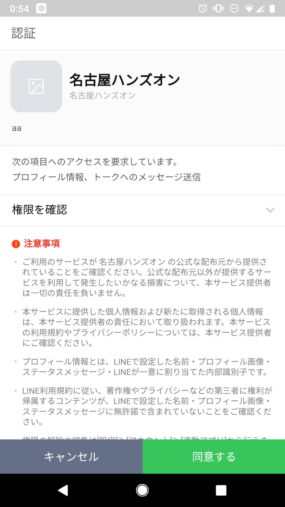

今はまだページを作っていないので、エラーになります。skill.jsに以下のようなコードを追加してみましょう。

([src/sample/tutorial5.js](https://github.com/ozyozyo/clova-cek-tutorial-nodejs/blob/master/src/sample/tutorial5.js)を参照)
```
var lastPrefecture = '未設定です';

...
switch (intentName) {
  case 'AnswerPrefecture':
    ...
    lastPrefecture = slots.AnsweredPlace;
...

app.get('/liff', function(req, res) {
  var html = `<html>
    <body>
      <head>
        <title>LIFFテスト</title>
        <script src="https://d.line-scdn.net/liff/1.0/sdk.js"></script>
      </head>
      <script>
        window.onload = function (e) {
          liff.init(function (data) {
                document.getElementById('userId').textContent = data.context.userId;;
          });
        };
      </script>
      <h2>最後に聞いた都道府県は...！</h2>
      <span>${lastPrefecture}</span>
      <h2>あなたのUserIdは</h2>
      <span id="userId"></span>
    </body>
  </html>`;
  res.send(html);
});
```

これで、スキルに最後に話しかけた都道府県が`line://app/数字-アルファベット`を開くと表示されるようになりました。
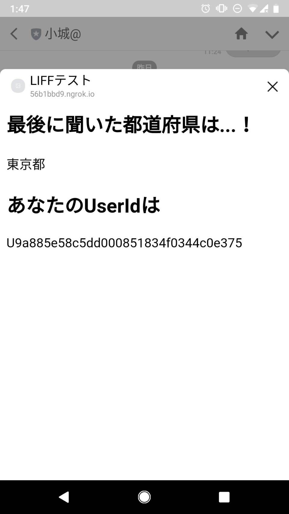
